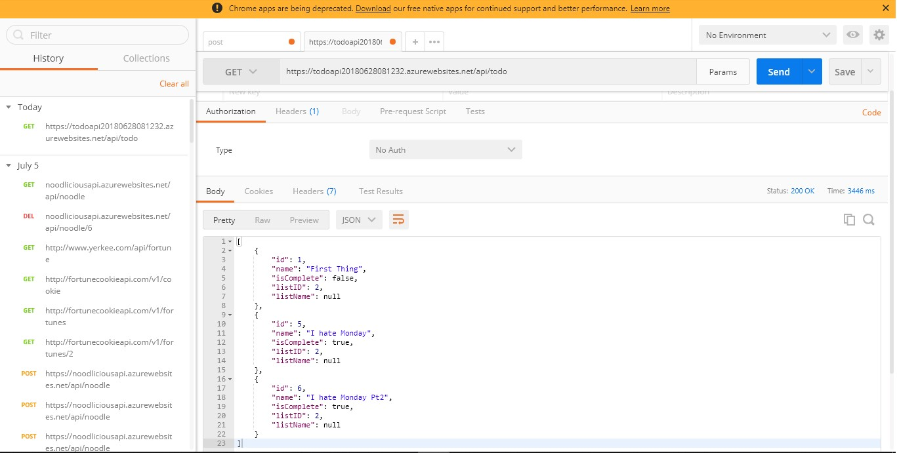
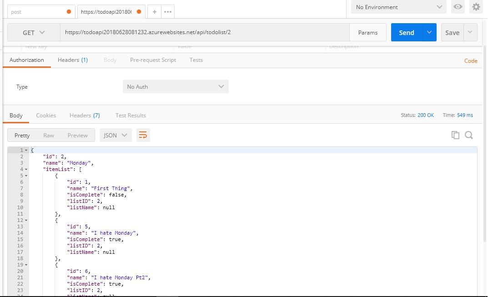
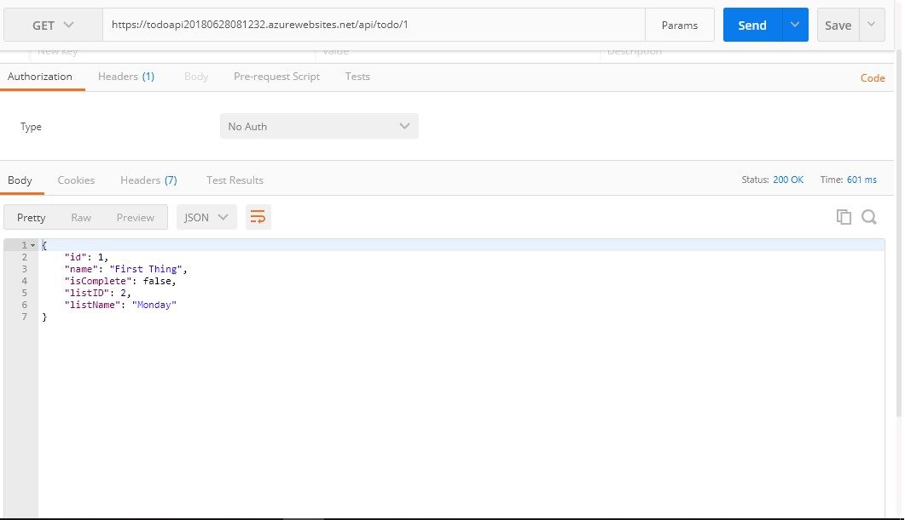
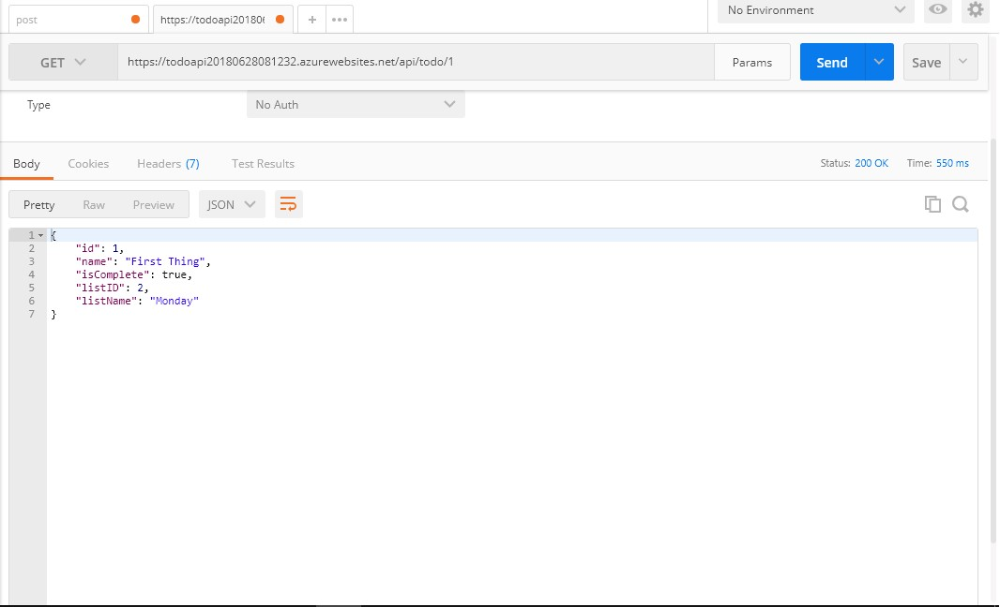
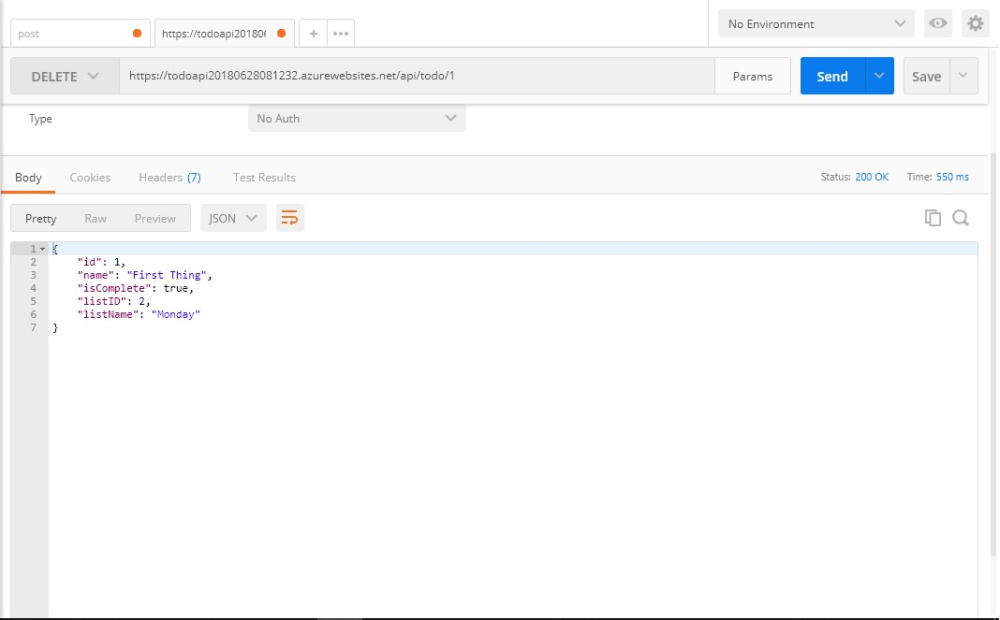
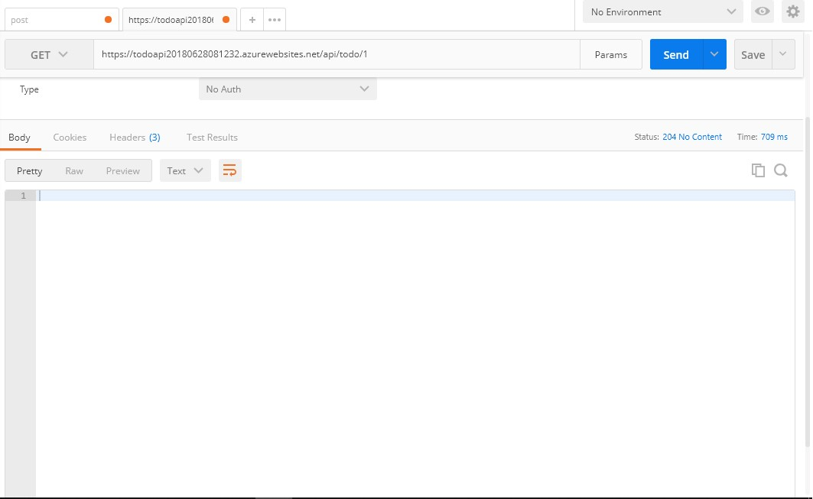
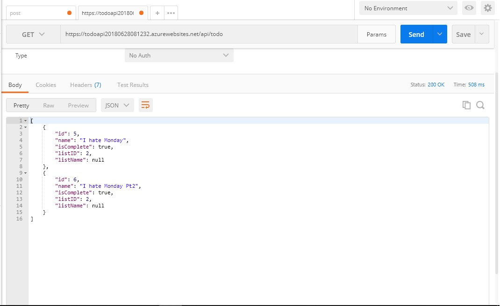

# Lab17_WebAPI

## About this project
This project is a MVC application that builds an API for consumption in Lab 18. The API was designed and deployed in a database, with URL endpoints to be able to perform CRUD operations. CRUD operations were tested, and the database was seeded using Postman.

## Example Screenshots

## How to use
This program requires Visual Studio to view or edit the source files or database. The program does not require visual studio if the user simply wants to navigate to the site. The URL to the deployed site is:

https://todoapi20180628081232.azurewebsites.net/

Once on the site, the user can click on the hyperlinks to perform their desired operation.In order to Post, Put, or Delete, the user must use Postman, Curl, or a front-end application.

### How to Get To do Items

Since this is an API, you must use a front-end interface, or a program like Postman in order to use the API. In these examples we will use Postman. 
If you look at the above screenshot, you simply set the base URL in postman to the one mentioned in the above paragraph. From there you can do all the CRUD operations through changing the URL and type of request.

In a GET request, you select GET from the dropdown menu on the left, then decide if you want to get the todo items or the todo lists by setting the URL. In the example above a request was made to get all items by the /api/todo extension. Since no ID was specified, the response is a JSON object with all the current items.

### How to Get To do List

To get a list is the same process as getting an item. The only difference is that you use the URL /api/todolist, which returns a response body object of the available lists.

### How to Get a specific item or list

To get a specific item or list, you append the ID number to the URL, as seen above.

### How to Post or Put of a specific item or list

### How to Delete a item or list

## Licensing
This program is used with a MIT license.