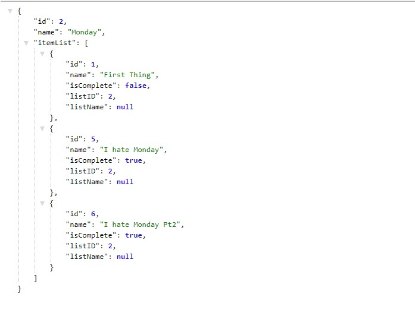
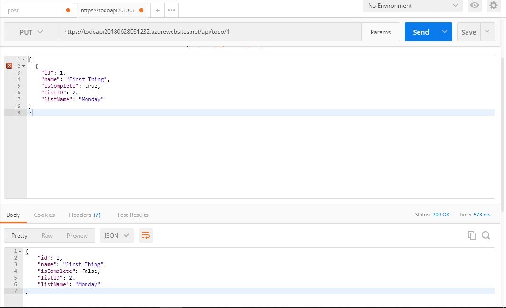

# Lab17_WebAPI

## About this project
This project is a MVC application that builds an API for consumption in Lab 18. The API was designed and deployed in a database, with URL endpoints to be able to perform CRUD operations. CRUD operations were tested, and the database was seeded using Postman.

## Example Screenshots

## How to use
This program requires Visual Studio to view or edit the source files or database. The program does not require visual studio if the user simply wants to navigate to the site. The URL to the deployed site is:

https://todoapi20180628081232.azurewebsites.net/

Once on the site, the user can click on the hyperlinks to perform their desired operation.In order to Post, Put, or Delete, the user must use Postman, Curl, or a front-end application.

### How to Get To do Items

Since this is an API, you must use a front-end interface, or a program like Postman in order to use the API. In these examples we will use Postman. 
If you look at the above screenshot, you simply set the base URL in postman to the one mentioned in the above paragraph. From there you can do all the CRUD operations through changing the URL and type of request.

In a GET request, you select GET from the dropdown menu on the left, then decide if you want to get the todo items or the todo lists by setting the URL. In the example above a request was made to get all items by the /api/todo extension. Since no ID was specified, the response is a JSON object with all the current items.

### How to Get To do List

To get a list is the same process as getting an item. The only difference is that you use the URL /api/todolist, which returns a response body object of the available lists.

### How to Get a specific item or list

To get a specific item or list, you append the ID number to the URL, as seen above. In the example, we are simply returning the response body for list item 1. You will see in the bottom window in postman a status signaling "Ok." If you get a "Status 400 bad request," it means that something in the request you sent was incorrect. This is likely due to something misttyped in the URL. If you get a code stating "No content" it means the ID you requested does not exist. In order to see the available lists or items, use a get command without an ID set to return the available items.

### How to Post or Put of a specific item or list

Both a put or post command will either create or update a list. The main difference is a POST is used when you are creating a new entry, and a PUT is used when you are updating an existing entry. In the example below we are updating one of the list items. To do so, you change the command in Postman to PUT, then in the PARAMS section, enter the information as you would like it changed. In the example we are changing the todo item to complete by adjusting the boolean value to "true." 

Once you run the command, you will see in the bottom output window a "Ok" status as shown below.

One thing to remember is if you are running a PUT command to update an existing entry, you MUST include the ID of the entry that you are trying to adjust. If you enter a request body without an ID, it will create a new entry. If you are trying to create a new entry, use a POST command in the dropdown box, then enter the request body without an ID. The reason for this is the API is stored in a database, and each ID corresponds to a database PRIMARY KEY for the entry. The database will automatically set the ID when a new entry is created.

### How to Delete a item or list

To DELETE a item or list it is much the same as a PUT or POST. You select the DELETE option from the Postman dropdown box, then make sure the URL is set to the ID of the entry that you wish to delete, as seen below.

After you run the command you will notice a blank box in Postman for the response body, along with the message "No content." That is ok, that means the item you selected was indeed deleted, as shown below.

However, it is always a good idea to confirm that the entry is actually deleted. In the below screenshot, a GET request was run for all the items, just to confirm that the object with the ID and body of the entry that was deleted no longer exists.

### Summing it up

To recap, you can perform all the Create, Read, Update, or Delete commands with this API. However, since it has no front-end, you need to either make your own, or use a program like Postman(which is featured in the examples), or Curl(if you like to stick to the command line). Then it is simply a matter of setting the correct URL and performing the operation. In all cases you will receive a response body from the API, which will contain a status message that the operation was successfully performed, or that something went wrong. If something does go wrong, check that the URL you entered is correct, or that the request body matches the JSON format the API is expecting. The response body (with the exception of the DELETE which returns no body) is a JSON object which can be parsed and used in your own front-end applications. 

Happy coding!
## Licensing
This program is used with a MIT license.
